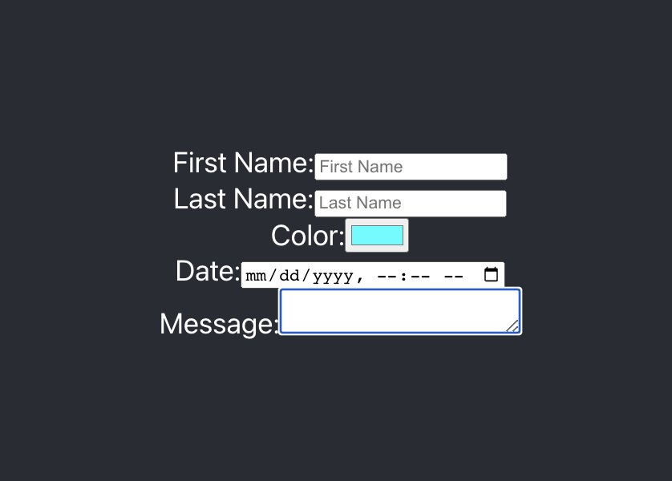

# Form Practice - React.js App 
Building a React app with onChhange functionality for and HTML form for BocaCode in class practice.



## Covered in Class
* onChange
* Form Elements
* Controlled Components

## Basic Code
```
<label>First Name:
  <input type="text">
<label/>

```